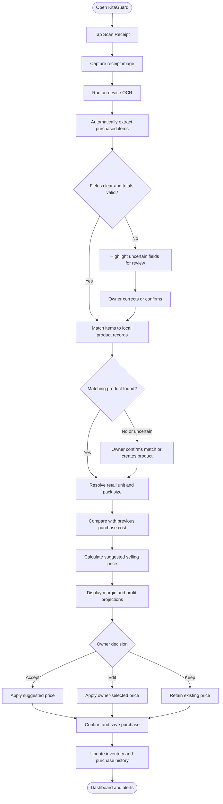
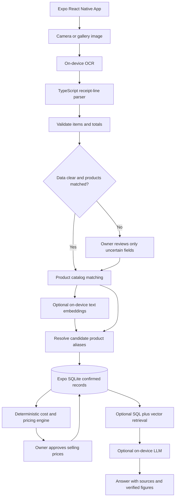
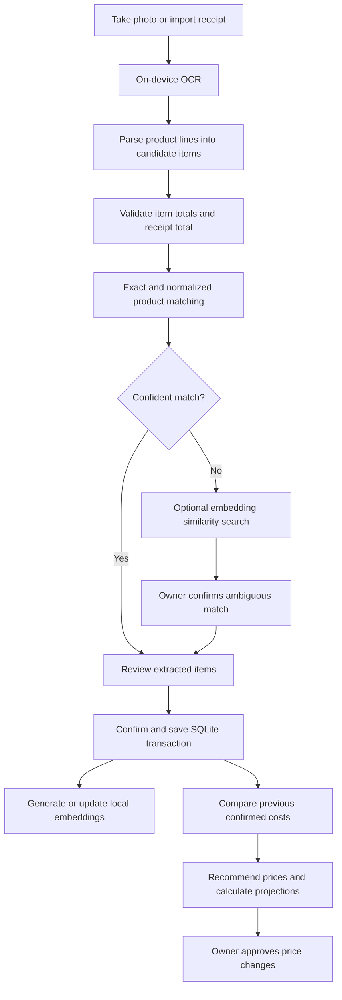
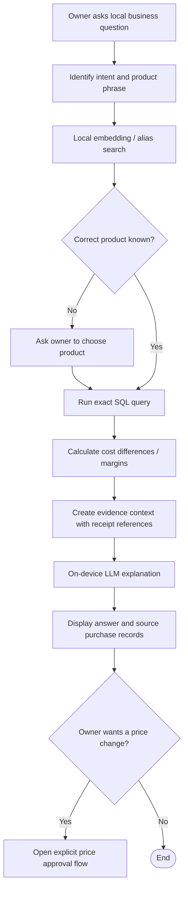

# TindaWise AI: KitaGuard

**Offline AI-Powered Receipt Processing, Inventory Cost Tracking, and Smart Pricing Assistant for Filipino Micro-Retailers**

**Document type:** Problem Statement, User Flows, AI Architecture, and Technology Stack  
**Updated:** October 9, 2026  
**Status:** Proposed 24-hour hackathon MVP with optional on-device RAG extension  
**Primary platform:** Android-first mobile application built with React Native + Expo (TypeScript)  
**Target users:** Sari-sari store owners, small retailers, market vendors, and neighborhood resellers

---

## 1. Project Overview

TindaWise AI: KitaGuard is an **offline-first Android mobile application** that helps small retailers turn supplier receipts into useful purchasing and pricing information. Using **on-device optical character recognition (OCR)** and local receipt interpretation, the system automatically extracts recognizable purchased items, quantities, and costs from receipt photos. It then compares newly purchased products with previously recorded purchase costs and suggests selling prices based on configurable profit-margin targets.

The application is designed to answer three questions for a store owner:

1. **What did I buy, and how much did it cost?**
2. **Which products became more expensive since my last purchase?**
3. **What selling prices would help me maintain my target gross margin?**

The system can also estimate **potential revenue and gross profit** if the scanned inventory is sold at the selected prices. These projections are **not actual earnings**. Actual revenue is recorded only after a sale occurs.

**Optional AI extension:** Local text embeddings can help find products with different receipt labels. A local retrieval-augmented generation (RAG) assistant can answer questions about *confirmed* purchasing records by retrieving relevant local evidence and explaining results supplied by deterministic database queries and calculations.

### Core concept

> **Scan what you bought → Identify what changed → Decide how to price it.**

Unlike a general-purpose personal budget tracker, KitaGuard focuses on the relationship between **supplier purchase costs, product quantities, store inventory, and retail selling prices**.

---

## 2. Problem Statement

Many Filipino micro-retailers record purchases manually in notebooks, calculators, or spreadsheets. Each time they buy inventory from suppliers, they may need to copy receipt details, calculate per-product costs, update available stock, check old prices, and decide whether their retail selling prices should change.

This workflow can be slow and error-prone, especially when product costs change frequently or when suppliers sell items in **packs, bundles, or cases** while the store sells products individually. Without organized purchase history, business owners may continue using outdated selling prices and experience reduced gross profit margins without noticing.

Some existing retail and accounting systems can perform parts of this process, but cloud-dependent solutions may be less practical when internet connectivity is limited, and sophisticated POS systems may be excessive for very small shops.

**Central problem:**

> Micro-retailers lack a simple, accessible way to automatically turn supplier receipts into accurate product-level cost records and actionable pricing decisions—especially without relying on a continuous internet connection.

### Specific problems to address

| ID | Problem | Consequence |
|---|---|---|
| P1 | Manually encoding receipt line items | Wasted time and inconsistent records |
| P2 | Difficulty recognizing price changes between supplier purchases | Increased costs can go unnoticed |
| P3 | Purchasing goods by case/pack but selling by piece | Incorrect cost-per-unit calculations |
| P4 | Selling prices based on memory or outdated supplier costs | Reduced margins or accidental underpricing |
| P5 | No quick way to compare possible selling prices | Pricing decisions made without seeing potential profit |
| P6 | Disconnected receipts and inventory records | Unclear stock levels and purchasing history |
| P7 | Unreliable internet or privacy concerns | Cloud-based tools may not be usable or desirable |

---

## 3. Proposed Solution

KitaGuard combines these capabilities in one offline-first mobile workflow:

1. **Automatic receipt capture and text recognition:** The owner takes a picture of a supplier receipt; the bundled on-device OCR model extracts readable text.
2. **Automatic item-level extraction:** The receipt interpretation engine identifies recognizable product descriptions, quantities, unit costs, and line totals, rather than storing only the receipt grand total.
3. **Review of uncertain data:** The app flags ambiguous or missing fields; the user only corrects items that need attention. It must never silently invent a quantity or price.
4. **Purchase-history matching:** Recognized products are matched to local inventory records, first by exact identifiers and normalized names, then optionally by on-device semantic embeddings; uncertain product matches require confirmation.
5. **Wholesale-to-retail unit conversion:** The system can calculate the cost per individual item when pack size is known or confirmed.
6. **Price-change detection:** The current acquisition cost is compared with the last recorded purchase cost for the same unit of measure.
7. **Smart pricing recommendations:** A deterministic pricing engine suggests a retail selling price based on the cost and the owner's chosen target gross margin, with optional rounding rules.
8. **Profit projection and approval:** The owner reviews recommendations, accepts or adjusts prices, and sees projected revenue and gross profit.
9. **Local recordkeeping:** Purchases, product history, prices, and stock updates are stored in an on-device SQLite database.
10. **Optional local RAG assistant:** The owner can ask historical questions in English or Taglish. The app retrieves local records and calculations and passes that context to a small local language model for explanation.

**Local AI is used for perception and interpretation (OCR, optional receipt parsing assistance, embeddings, and optional RAG explanations), while financial arithmetic is performed by verified TypeScript application formulas.**

---

## 4. Intended Users

**Primary user: Store owner / small retailer**

- Purchases merchandise from wholesalers or suppliers.
- Receives printed, sometimes abbreviated, supplier receipts.
- Needs to monitor acquisition costs and profit margins.
- May have limited or inconsistent internet connectivity.
- May not use a full POS or accounting platform.

**Representative scenario:** A sari-sari store owner buys assorted drinks, snacks, and bottled water from a wholesaler, then sells them individually at the neighborhood store.

---

## 5. Current User Flow (Without KitaGuard)

1. Store owner purchases products from a supplier.
2. Supplier provides a receipt or invoice.
3. Owner manually reads and lists each purchased product.
4. Owner manually calculates item subtotals and total expenses.
5. Owner estimates individual item costs for products bought in packs or cases.
6. Owner tries to remember the previous cost of each product or searches old records.
7. Owner decides selling prices, often using habit or rough estimates.
8. Owner manually updates stock counts and keeps the receipt for reference.

**Pain point:** Receipt data is not immediately translated into a reliable view of cost changes, margins, and pricing decisions.

---

## 6. Proposed End-to-End User Flow (With KitaGuard)

### Phase A — Capture and extract

**Step 1: Open the application**  
The owner sees a dashboard with inventory, recent purchases, price-change alerts, and the **Scan Receipt** action.

**Step 2: Scan a supplier receipt**  
The owner takes a photo with the Android phone camera or selects a locally stored receipt image. The system checks that the image is usable and runs OCR on the device. **Product details are not typed manually as the standard workflow.**

**Step 3: Automatically extract purchased items**  
The app processes the OCR text and attempts to create structured receipt items:

- Supplier name and purchase date, when present
- Product name/description
- Purchase quantity and unit of measure
- Unit cost or line subtotal
- Document subtotal, discounts, and grand total, when present

If the receipt provides only some fields, the parser uses mathematically justified derivations (for example, `line total / quantity`) only when all required information is clearly known. Otherwise, it marks the field as unresolved.

**Step 4: Validate the extraction**  
The app checks calculated line totals and compares the sum of items with the receipt total, taking identified discounts into account. It presents an editable summary. Clear entries require no typing; only unclear or inconsistent entries need user input.

### Phase B — Understand inventory costs

**Step 5: Match products to saved inventory**  
The app checks local product records. It may recognize that `COKE 295ML` and a previously saved `Coca-Cola Mismo 295 mL` are the same product. If confidence is low or multiple products could match, the owner confirms the match.

**Step 6: Convert wholesale purchases into retail units**  
For example, if a case contains 24 bottles and costs ₱528, the app computes **₱22 per bottle**. A pack-size value must come from the receipt, a saved product configuration, or the owner's confirmation—not a guess from the AI.

**Step 7: Compare current and previous costs**  
The app retrieves the last confirmed acquisition cost **for the same retail unit** and calculates the cost difference and percentage change. Products with no purchase history are labeled **New / No prior cost**.

### Phase C — Decide on selling prices

**Step 8: Generate selling-price recommendations**  
For each product, the app uses the current unit cost, chosen target gross margin, and optional pricing increments (e.g., rounding to the nearest ₱1 or ₱5) to calculate a suggested selling price. It shows the previous selling price, the proposed price, and the margin implications.

**Step 9: Review and approve pricing**  
The owner can **Accept**, **Edit**, or **Keep Existing Price** for each product. The app never changes a selling price without an explicit user action.

**Step 10: View projected financial outcomes**  
The system recalculates projected revenue, purchase costs, and gross profit immediately for the selected prices and quantities. It clearly labels these figures as projections assuming the relevant stock is sold.

### Phase D — Save and track

**Step 11: Save the purchase and stock update**  
After final confirmation, the app saves the purchase details and corresponding inventory changes in its local database. It preserves purchase-cost history and the approved selling price for later comparisons.

**Step 12: Record actual sales (optional in MVP)**  
When actual product sales are entered in a later session, the app reduces stock and calculates realized sales revenue and profit based on the inventory costing method implemented.

---

## 7. User Flow Diagram



**Important design principle:** There should be **no manual item-by-item entry in the normal scan flow**. Human review is retained to catch OCR errors and prevent incorrect financial records.

---

## 8. Illustrative User Scenario

A store owner has a saved record for a bottled drink:

| Attribute | Previous record | New purchase |
|---|---:|---:|
| Cost per bottle | ₱20.00 | ₱22.00 |
| Retail selling price | ₱25.00 | Not yet updated |
| Quantity newly purchased | — | 15 bottles |

**System analysis**

1. OCR automatically recognizes the line item from the new receipt.
2. KitaGuard matches it to the saved bottled-drink product.
3. The price-change engine detects that unit cost increased by **₱2 (10%)**.
4. Keeping the old ₱25 selling price would reduce gross profit per newly purchased unit from **₱5 to ₱3**; gross margin would drop from **20% to 12%**.
5. With a **25% target gross margin**, the raw recommended selling price is `₱22 / (1 - 0.25) = ₱29.33`. Rounding upward to a whole peso gives **₱30**.
6. The user approves ₱30 as the new selling price.
7. If all **15 newly purchased bottles** sell at ₱30:
   - **Projected revenue:** `15 × ₱30 = ₱450`
   - **Purchase cost:** `15 × ₱22 = ₱330`
   - **Projected gross profit:** `₱450 − ₱330 = ₱120`
   - **Projected gross margin:** `₱120 / ₱450 = 26.67%`

*These are illustrative gross figures, not actual realized revenue or net profit. They exclude rent, transport, spoilage, taxes, and other expenses. Existing stock may have a different cost basis.*

---

## 9. Business Rules and Calculations

For reliable results, the application should use **deterministic calculations** rather than relying on an LLM for math.

| Output | Rule |
|---|---|
| Purchase line total | `quantity × unit cost` |
| Cost per retail unit | `wholesale pack cost / confirmed units per pack` |
| Unit cost change | `new unit cost − previous unit cost` |
| Cost change percentage | `(new cost − previous cost) / previous cost × 100` (when previous cost > 0) |
| Gross profit per unit | `selling price − unit cost` |
| Gross margin | `(selling price − unit cost) / selling price × 100` (when selling price > 0) |
| Suggested selling price | `unit cost / (1 − target gross margin as decimal)` |
| Projected gross revenue | `sum(selling price × projected units sold)` |
| Projected gross profit | `projected gross revenue − cost basis of projected units sold` |

### Safeguards

- Do not confuse **gross margin** with **markup**; they have different formulas.
- Reject target-margin inputs of 100% or higher for this formula.
- Use money-safe numeric storage (integer centavos or fixed decimal arithmetic), not unguarded floating-point totals.
- Ensure quantities, unit sizes, and costs are comparable before analyzing historical changes.
- Distinguish **historical purchase cost** from the **cost basis of current stock**; the MVP can project on the newly purchased batch only.
- Do not count projected revenue as an actual sale.
- Require user approval before saving uncertain OCR values or updating retail prices.

---

## 10. Key Screens

1. **Dashboard:** Recent purchases, current inventory summary, alerts, and Scan Receipt button.
2. **Camera / Import Receipt:** Capture photo, crop or retake, and start offline OCR.
3. **Extracted Products Review:** Automatically populated product rows with highlighted uncertainties and receipt-total validation (no routine manual product encoding).
4. **Cost Comparison:** Prior cost, new cost, percent change, unit conversions, and newly detected products.
5. **Smart Pricing:** Proposed selling prices, margin impact, and Accept/Edit/Keep choices.
6. **Profit Simulator:** Projected revenue and gross profit based on chosen prices and quantities.
7. **Purchase History / Inventory:** Stored receipts, matched items, approved selling prices, and stock records.
8. **Ask KitaGuard (optional RAG):** Conversational history questions, supporting purchase references, and audited price calculations.
9. **Offline Model Readiness (optional):** Displays whether OCR, embedding, and LLM assets are available on-device before entering airplane mode.

---

## 11. Updated Technology Stack — React Native + Expo

**Decision:** Use **React Native + Expo + TypeScript**, not Kotlin/Jetpack Compose. Target Android first to minimize hackathon build and testing complexity. The native OCR and on-device inference integrations require **an Expo development build or a native/EAS build; Expo Go alone is not sufficient**.

| Layer | Selected / candidate technology | Responsibility | Priority |
|---|---|---|---|
| Mobile app | React Native + Expo + TypeScript | Cross-platform codebase, Android-first prototype | Required |
| Routing | Expo Router | Screen navigation | Required |
| UI | React Native components; NativeWind if team prefers | UI and responsive layouts | Required |
| Camera and image selection | `expo-camera`, `expo-image-picker` | Capture/import receipt images | Required |
| Preprocessing | `expo-image-manipulator` | Crop/rotate/resize images prior to OCR | Recommended |
| On-device OCR | **`expo-ocr-kit`** (ML Kit on Android / Vision on iOS) | Recognize printed receipt text and line bounding boxes | Required; test first |
| OCR alternative | `expo-text-extractor`, or ExecuTorch PaddleOCR | Alternate native OCR approach if primary integration fails | Fallback |
| Receipt parser | TypeScript parsing rules + OCR line geometry + validation | Convert recognized text to structured products | Required |
| Local relational storage | **`expo-sqlite`** | Receipts, products, purchases, inventory, prices, settings | Required |
| State | Zustand (or React hooks if simpler) | UI state and current scanning workflow | Recommended |
| Pricing/calculations | TypeScript, integer-centavo or decimal-safe math | Cost conversion, margins, suggested prices, projections | Required |
| On-device embeddings | **`react-native-executorch`** with a small text embedding model | Semantic product alias matching; document retrieval | Optional phase 2 |
| Local vector search | Simple cosine similarity initially; **`sqlite-vec`** when integrated | Find semantically similar names or local note chunks | Optional phase 2 |
| On-device LLM | **`react-native-executorch`** Qwen/SmolLM/LFM model; `llama.rn` as alternative if tested | Explain records using retrieved local evidence | Optional phase 3 |
| Offline packaging | Bundled OCR; pre-bundled or downloaded/cached model assets | Ensure no model download is needed during demo | Required for chosen AI feature |

**No Firebase, Supabase, hosted vector database, cloud inference API, or Node.js server is required for the proposed offline core.** An optional online synchronization feature would be outside MVP scope.

### Local AI choices and selection guide

**Image-to-text (OCR):**

1. **`expo-ocr-kit` (preferred initial test):** an Expo-native image OCR module, with Android ML Kit and iOS Vision backends; returns recognized text and blocks. Capture a photo with `expo-camera`, then pass its local URI to OCR. Verify the exact Android dependency includes an **on-device/bundled** ML Kit model for offline first-launch behavior.
2. **`expo-text-extractor` (fallback):** another Expo text extraction library. Verify its supported SDK and model deployment before selecting it.
3. **React Native ExecuTorch PaddleOCR (alternative):** an explicit neural OCR runtime; potentially more involved to integrate and package, so use only if the simpler route fails or performs poorly on sample receipts.

**Local text embeddings:**

- **all-MiniLM-L6-v2:** practical initial model for English-like product descriptions and small local vector indexes.
- **paraphrase-multilingual-MiniLM-L12-v2:** candidate if Tagalog/Taglish descriptions matter; larger, so check performance on the actual phone.
- **LFM embedding variants:** another supported model family to benchmark if the first choice underperforms.

Embeddings are **suggestion mechanisms**, not proof that two items are identical. Require exact checks on product size, brand, unit, packaging, and explicit owner confirmation for uncertain matches.

**Local text-generation models (stretch goal):**

- **Qwen 2.5 0.5B** or **Qwen 3 0.6B**: candidate lightweight multilingual explanation assistant models.
- **SmolLM2 360M**: smaller model family for more constrained devices; may provide less capable answers.
- **LFM 2.5 350M**: another compact text-generation option in the ExecuTorch model ecosystem.
- **Llama 3.2 1B**: larger option for more capable devices, subject to measured memory and latency.

**Important:** These are *candidates*, not confirmed to work on your team's phone until tested. Check the currently supported exported model variants, licensing, device architecture, RAM usage, tokenization, Android OS requirements, and React Native/Expo SDK compatibility. Model storage size is not the same as peak runtime RAM.

### Expo native-build constraints

- Use a **development build**, not standard Expo Go, because OCR and ExecuTorch contain custom native code.
- `react-native-executorch` 0.10.x requires **Expo SDK 55+**, New Architecture, and version-compatible `react-native-worklets`; SDK 55/56 may need explicit versions for Worklets/Reanimated. Consult the **live compatibility matrix** rather than assuming `npm install` will select a working combination.
- The current ExecuTorch documentation also lists platform-level requirements; check the **actual Android version** of your demo device before choosing it.
- Pre-download model files or bundle them in the APK. Demonstrate with airplane mode active *after* verifying each required model is loaded locally.
- OCR, embedding generation, and LLM inference must run on the phone. A model running on a laptop or reachable via local network is **not on-device mobile inference**.

### Suggested project setup (validate package compatibility before executing)

```bash
npx create-expo-app@latest tindawise-ai
cd tindawise-ai
npx expo install expo-camera expo-image-picker expo-image-manipulator expo-sqlite
npm install zustand expo-ocr-kit
npx expo run:android
```

Only after the core receipt scanner works, consider:

```bash
npm install react-native-executorch react-native-worklets react-native-blob-util
# Follow the package's current compatibility guide, then rebuild the native app.
```

Do not pin an unverified SDK/worklets combination in the middle of the hackathon.

---

## 12. Local AI Architecture and Responsibilities



### What the AI does — and does not do

| Task | Responsible component |
|---|---|
| Read photographed text | OCR neural model on device |
| Group OCR lines into product rows | Parser rules + geometry; local model assistance optional |
| Identify similar product descriptions | Exact/normalized matching, optionally embedding similarity |
| Persist purchase and history data | SQLite transactions |
| Find the latest confirmed unit cost | SQL query, not a vector search |
| Compute selling price and gross profit | Deterministic TypeScript calculation engine |
| Retrieve related notes/aliases | Optional embedding model + vector search |
| Respond conversationally | Optional local LLM grounded in retrieved records |

**Critical separation:** Semantic retrieval is useful for *finding relevant records*; it should not decide that a value from an older receipt is the latest cost. Resolve entity IDs, timestamps, quantities, and monetary values using SQLite and explicit arithmetic.

---

## 13. Local Embedding + RAG Feasibility

**Yes, local embedding-based retrieval and local RAG are technically feasible within a React Native + Expo development build**, provided the selected on-device runtime, model files, SQLite extension, and Android device are compatible.

RAG = **Retrieval-Augmented Generation**: retrieve trustworthy local data, augment a prompt with that data, then generate a natural-language explanation using a local LLM.

**Two valuable but distinct uses:**

1. **Embedding-based product matching (no LLM required):** find candidate catalog entries for abbreviations such as `COKE MISM 295` vs `Coca-Cola Mismo 295 mL`. Validate unit size and other structured fields before linking records.
2. **Full local RAG assistant (LLM required):** answer questions such as, "Magkano last bili ko sa Coke Mismo, and may tubo pa ba at ₱30?" using purchase history, the pricing engine, and references to the actual stored receipts.

RAG is **not required** to compute expenses, inventory totals, or recommended prices; those are database and business-logic operations.

### Local knowledge-base contents

Store the following **only after user confirmation**:

- Stable `product_id`, canonical product name, aliases, brand, variant, base retail unit, and unit count per pack (if known).
- Receipt metadata: date, supplier, unique receipt ID, photo URI and extracted text (where the user keeps it).
- Purchased item data: receipt ID, product ID, quantity, unit/pack information, purchase unit cost, line total.
- Approved selling price and purchase-cost history, with dates.
- Optional semantic chunks describing receipt notes, confirmed aliases, and supplier/product descriptions.
- Embedding vectors linked to the `product_id` or `document_chunk_id` from which they were generated.

**Do not index unreviewed OCR as authoritative business history.** You can keep raw OCR text for auditing, but use confirmed structured records to answer numeric questions.

---

## 14. Updated User Flow A — From Receipt to Local Knowledge Base

**Goal:** Automatically extract purchased products, preserve history, and build searchable local knowledge without manual line-item encoding as the default.

1. **Open app / choose Scan Receipt.** The app displays that local OCR is ready.
2. **Capture/import receipt.** Optionally crop or rotate for better text quality.
3. **Run on-device OCR.** Recognize line text and bounding boxes, even with no internet.
4. **Structure receipt automatically.** Detect supplier/date/product rows/quantity/unit cost/line total; ignore tax, tendered cash, and change lines.
5. **Validate mathematical consistency.** Compare line totals against quantities, prices, known discounts, and receipt grand total.
6. **Find matching catalog products.** First attempt exact SKU/barcode, confirmed aliases, normalized names; optionally query embeddings for close candidates.
7. **Resolve uncertain fields.** Owner corrects only missing/ambiguous details, chooses among candidate matches, and confirms pack sizes when necessary.
8. **Save confirmed receipt atomically in SQLite.** Write the receipt, line items, cost history, and inventory delta in a transaction; prevent accidental duplicate imports.
9. **Create/update embeddings (optional).** Generate local vectors for canonical product names and confirmed aliases; update linked index entries when a product changes.
10. **Run pricing engine.** Retrieve previous unit costs, calculate any increase, recommend selling prices, then show owner approval and projected outcomes.



**Fallback:** If local embeddings fail or are unavailable, matching continues through aliases and deterministic rules. Receipt scanning remains usable.

---

## 15. Updated User Flow B — Local RAG Business Assistant

**Goal:** Ask natural-language questions about previous expenses, supplier costs, and hypothetical profits, with answers grounded in local purchase records.

### Example query

> "Magkano last bili ko sa Coke Mismo? Tumubo pa ba ako kung ₱30 selling price?"

1. **User opens Ask KitaGuard**, enters a question in English or Taglish, and selects a product if the query is ambiguous.
2. **Query understanding:** Detect product or supplier names, likely intent (`latest_cost`, `history`, `price_comparison`, `projection`), and hypothetical inputs such as `selling_price = ₱30`. Use deterministic intent handling when practical; a small local LLM is optional.
3. **Local semantic retrieval:** Generate a query embedding and search local product aliases/document notes for likely matches. (A normalized name/SQL-first search may be enough for well-structured queries.)
4. **Resolve the exact product ID:** Check product variant, packaging, size, and units. Ask the owner to disambiguate if multiple products match.
5. **Run authoritative SQL:** Retrieve the most recent confirmed purchase for the exact product and the selected unit of measure, with date and supplier. Fetch earlier purchases if a comparison is requested.
6. **Run exact calculations:** The TypeScript pricing engine computes cost changes, gross profit per piece, projected revenue and margin using the user's confirmed inputs.
7. **Create grounded context:** Pass concise record snippets, timestamps, receipt references, unit metadata, and precomputed numeric results to the on-device language model.
8. **Local LLM responds:** Generate a short explanation in the user's language and identify the underlying purchase records. Clearly state if information is missing, uncertain, or only a projection.
9. **Optional action:** If the owner wants to adopt the new price, route to a regular **Review/Accept** screen; never let a free-form answer silently mutate inventory or selling prices.



### Illustrative grounded answer

> "Base sa na-confirm mong purchases, ang Coke Mismo 295 mL ay ₱20/bottle noong October 2 at ₱22/bottle noong October 9. Tumaas ng 10%. Kung ₱30 ang selling price, ₱8 ang projected gross profit kada bottle. Sa 15 bottles, ₱450 ang projected revenue at ₱120 ang projected gross profit. Sources: October 2 and October 9 receipts. Hindi pa ito actual sales."

The dates and costs above are **example records**, not actual customer data. If the product has no confirmed matching history, the assistant must report that fact, not fabricate a previous price.

### When RAG is useful vs unnecessary

| User question | Best retrieval / processing |
|---|---|
| "Ano total expenses ko this month?" | Direct SQL aggregate + precise calculation; LLM unnecessary |
| "Ano last cost ng Coke 295 mL?" | Exact product resolution + SQL latest purchase; LLM optional for wording |
| "Alin sa mga produkto ko ang biglang nagmahal?" | SQL history comparison + price change algorithm |
| "Hanapin yung Coke kahit 'COKE MISMO' sa resibo" | Local embeddings for aliases, then product verification |
| "Bakit mo nirecommend ang ₱30?" | Pricing-rule explanation plus optional local LLM summarization |
| "Ano ang mga note sa resibo ni Supplier A?" | Local document chunk retrieval + optional LLM summary |

---

## 16. Data Model for Inventory, Embeddings and RAG

Proposed SQLite tables (minimum columns are illustrative):

| Table | Fields / purpose |
|---|---|
| `products` | `id`, `canonical_name`, `brand`, `variant`, `base_unit`, `units_per_pack`, `current_selling_price_centavos` |
| `product_aliases` | `id`, `product_id`, `alias`, `verified_at` — confirmed alternate receipt descriptions |
| `receipts` | `id`, `supplier`, `purchased_at`, `photo_uri`, `ocr_raw_text`, `receipt_total_centavos`, `verification_status` |
| `purchase_items` | `id`, `receipt_id`, `product_id`, `description_on_receipt`, `quantity`, `units_per_pack`, `unit_cost_centavos`, `line_total_centavos` |
| `inventory_movements` | `id`, `product_id`, `event_type`, `quantity_change`, `source_receipt_id`, `created_at` |
| `price_history` | `id`, `product_id`, `price_type`, `unit_price_centavos`, `effective_at`, `source_receipt_id` |
| `sales` (optional MVP) | `id`, `occurred_at`, `total_centavos` plus `sale_items` to compute realized sales |
| `document_chunks` (optional) | `id`, `receipt_id`, `source_type`, `chunk_text`, `created_at`, `verified` |
| `embedding_records` (optional) | `id`, `entity_type`, `entity_id`, `model_id`, `dimension`, `vector` / `vec_row_id` |

Implementation rules:

- Use database foreign keys and transactions. Save verified receipt + purchase items + stock changes atomically.
- Enforce uniqueness or warn on supplier/date/receipt number/image hash combinations to prevent duplicate inventory additions.
- Track which **embedding model and dimension** generated each vector. Rebuild the local vector index if the model changes.
- Use vectors for retrieval, not as replacements for normalized product IDs and relational joins.
- Handle receipts with bundles, discounts, and multiple units explicitly. Do not assume a box/case conversion without evidence.
- Define a consistent inventory costing policy (e.g., newly purchased-batch projections for MVP; weighted-average or FIFO later).
- Allow users to inspect and delete local receipt data and models.

### Basic retrieval approach for a small hackathon dataset

For a catalog of dozens or hundreds of products, start with normalized-name matching and an in-memory top-K **cosine similarity** search over local embeddings. This simplifies debugging. If you later require scalable SQL-based vector search, Expo SQLite supports an optional bundled **`sqlite-vec`** extension when enabled in the native build configuration. Confirm support in the SDK version selected.

---

## 17. Scope and Timeline for the 24-Hour Hackathon

### Must-have: receipt-to-price workflow

- [ ] Android-first Expo development build installed on the real demonstration phone.
- [ ] Receipt camera/gallery capture and image rotation/cropping.
- [ ] Bundled or verified offline-capable native OCR; test after airplane mode is enabled.
- [ ] Automatically extract **multiple purchased product rows** on a supported set of real receipts.
- [ ] Review screen flags ambiguous OCR fields instead of asking for manual entry every time.
- [ ] `expo-sqlite` product catalog, purchase history, and stock records.
- [ ] Correct product matching through exact names/aliases, with owner confirmation fallback.
- [ ] Unit normalization and previous vs. current cost comparison.
- [ ] Deterministic selling-price recommendations from user-defined gross-margin target.
- [ ] Owner approves/edits prices; app displays updated **projected** revenue and gross profit.
- [ ] Demonstrate all required features with Wi-Fi/mobile data disabled.

### Stretch goal 1: on-device embeddings

- [ ] Run one small embedding model locally on the phone.
- [ ] Save vectors for confirmed product names and aliases.
- [ ] Suggest similar catalog matches for abbreviated product descriptions.
- [ ] Validate close candidates against product size and packaging.

### Stretch goal 2: full local RAG

- [ ] Install/load a quantized local LLM on the phone.
- [ ] Build a simple chat UI with 3–5 supported business questions.
- [ ] Retrieve confirmed historical records and calculate numeric results outside the LLM.
- [ ] Show source receipt/date references with every historical answer.
- [ ] Confirm inference continues in airplane mode with model assets already cached.

### Not required for the 24-hour MVP

- Universal OCR accuracy across every receipt layout or handwriting style.
- Fine-tuning or training custom language models.
- Automatic inventory/price changes without human confirmation.
- Advanced POS features, online supplier feeds, electronic tax filing, and cloud sync.
- Predicting actual customer demand or guaranteeing future profits.
- Full local RAG if model compatibility, loading, or speed is unreliable.

### Suggested time allocation

| Hours | Focus | Demo milestone |
|---|---|---|
| 0–3 | Set up Expo development build, install OCR, confirm offline recognition | Phone recognizes text with airplane mode |
| 3–8 | Camera UI, OCR blocks, receipt row parser, review screen | Multiple items auto-populate |
| 8–12 | SQLite schema, purchase saving, repeat scan, product match | Two receipts stored and compared |
| 12–16 | Unit conversion, pricing engine, margin alerts, projection screen | Owner accepts price and sees numbers update |
| 16–19 | Stabilization, OCR accuracy on real receipts, duplicate checks | End-to-end workflow reliable |
| 19–22 | Optional local embeddings; RAG only if time remains | Similar product names resolve offline |
| 22–24 | Airplane-mode rehearsal, edge-case tests, pitch | Smooth live demonstration |

**Priority rule:** If OCR or native build integration is failing, do not spend the remaining hours building RAG. Finish a credible offline receipt-to-pricing product first.

---

## 18. Demo and Acceptance Tests

A successful core demo on a real phone:

1. Launch KitaGuard in **airplane mode** with all required OCR/model assets installed.
2. Scan a genuine, readable supplier receipt containing at least three product rows.
3. Show automatically extracted product names, quantities, purchase costs, and receipt-total checks.
4. Confirm the result and save it locally.
5. Scan a second receipt showing increased cost for a previously purchased item.
6. Show exact previous and current unit costs, percent change, and the projected margin if the selling price stays unchanged.
7. Show the suggested selling price, and compare projected revenue/gross profit as the owner edits and approves it.
8. Restart the app; demonstrate that inventory, receipts, and price history persist offline.

If embedding matching is implemented, also demonstrate `COKE 295ML` matching a saved `Coca-Cola Mismo 295 mL` record with explicit user confirmation when confidence is low.

If RAG is implemented, ask a historical price question offline and show (a) the retrieved receipt references, (b) the exact numeric calculation, and (c) the explanatory response. The assistant must report missing records rather than invent them.

### Validation checklist

- [ ] Every receipt photo used in the demo is actually processed by the local OCR model.
- [ ] No mocked AI output or hidden HTTP request substitutes for inference.
- [ ] OCR separates product lines from total, tax, payment, and change lines.
- [ ] Incorrect/ambiguous quantities and prices are reviewed before saving.
- [ ] Normalized units and pack sizes are correct before comparing purchase costs.
- [ ] Cost comparisons sort by confirmed purchase date and use the same unit basis.
- [ ] Financial formulas behave correctly when price is edited and when margin/quantity is zero or invalid.
- [ ] Revenue is labeled **projected** until actual sales are recorded.
- [ ] Exact receipt provenance is available for AI-generated historical explanations.
- [ ] The complete installed application remains useful without Wi-Fi or cellular data.

---

## 19. Value Proposition and Honest Differentiation

Receipt scanning, expense tracking, retail inventory management, and cost-based pricing recommendations already exist in commercial products. **Do not claim that any one of these features is a new invention.**

KitaGuard's proposed value is a lightweight, offline-first **receipt-to-pricing workflow** for Philippine micro-retailers: automatically recognize itemized supplier purchases, learn *confirmed* product aliases, flag supplier cost increases, protect target margins, and optionally answer questions using **local embeddings and grounded RAG**.

### Short hackathon pitch

> **TindaWise AI: KitaGuard** helps small Filipino retailers protect their margins. Scan a supplier receipt, automatically extract purchased items with on-device AI, compare with previous costs, and approve smarter selling prices. The phone can even retrieve past purchases and explain pricing decisions—without depending on the cloud.

### One-line summary

**From supplier receipt to informed retail pricing—with optional on-device memory and RAG, even offline.**

---

## 20. Technical References

Official docs and candidate library pages to verify against the *exact versions* installed:

- [Expo Camera](https://docs.expo.dev/versions/latest/sdk/camera/)
- [Expo SQLite and sqlite-vec configuration](https://docs.expo.dev/versions/latest/sdk/sqlite/)
- [expo-ocr-kit GitHub](https://github.com/ManojKanth/expo-ocr-kit)
- [React Native ExecuTorch getting started](https://docs.swmansion.com/react-native-executorch/docs/fundamentals/getting-started)
- [React Native ExecuTorch compatibility](https://docs.swmansion.com/react-native-executorch/docs/other/compatibility)
- [React Native ExecuTorch text embeddings](https://docs.swmansion.com/react-native-executorch/docs/extensions/text-embeddings)
- [React Native ExecuTorch local LLM models](https://docs.swmansion.com/react-native-executorch/docs/extensions/llm-chat-and-generation)

*This is a proposed technical design, not proof that every optional library has been tested together. Confirm actual Expo SDK, React Native, Android version, RAM, package compatibility, and offline model availability on your demo device before finalizing the stretch goals.*
